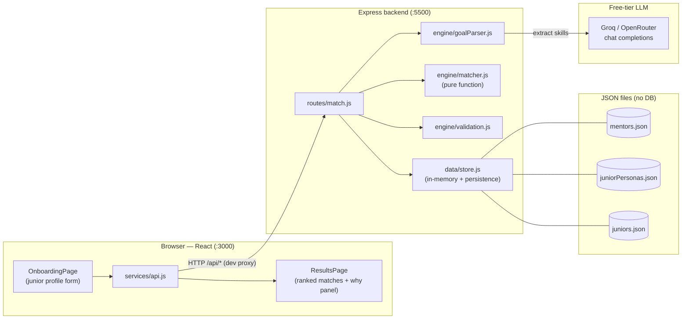
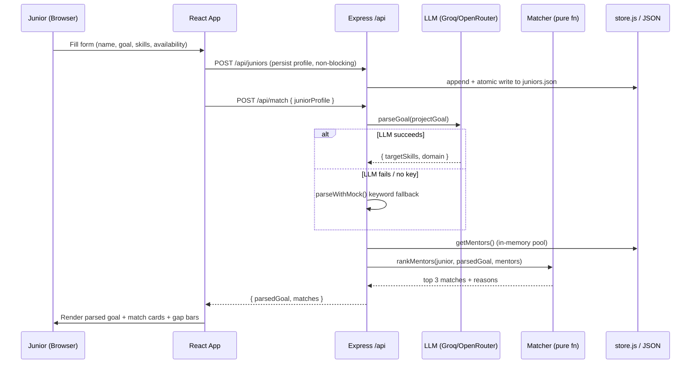
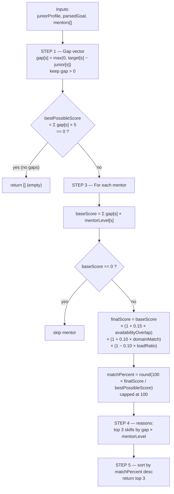
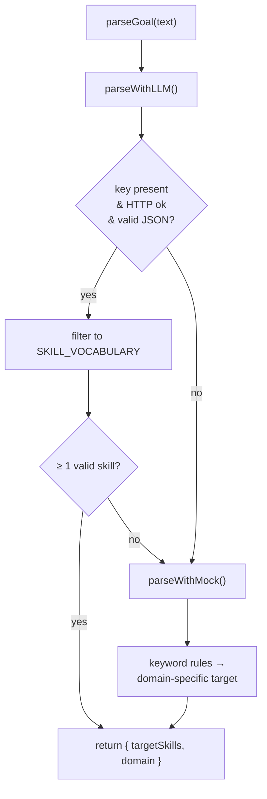
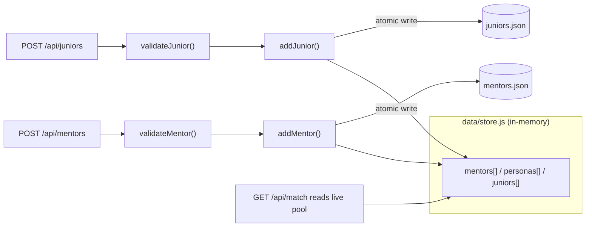

# Peer Mentor Matcher

Peer Mentor Matcher pairs junior developers with mentors based on their **actual skill gaps**, not tags. A junior describes what they want to build in plain English; the system uses an LLM to extract the required skills, computes the gap between where the junior is and where their project needs them to be, and then **deterministically** ranks mentors by how well they cover those specific gaps — showing the "why" behind every match.

- **Frontend:** React (Create React App), port `3000`
- **Backend:** Node.js + Express, port `5500`
- **LLM (goal parsing only):** free-tier Groq or OpenRouter (OpenAI-compatible), with a deterministic mock fallback
- **Storage:** JSON files (no database)

> The LLM is used **only** to turn free text into a structured skill target. All ranking is deterministic math, so results are reproducible and explainable.

---

## Table of contents

- [Architecture](#architecture)
- [End-to-end request flow](#end-to-end-request-flow)
- [Stage-by-stage: how it works](#stage-by-stage-how-it-works)
- [The matching engine](#the-matching-engine)
- [Goal parser + fallback](#goal-parser--fallback)
- [Onboarding & persistence](#onboarding--persistence)
- [API reference](#api-reference)
- [Project structure](#project-structure)
- [Setup & run](#setup--run)
- [Environment variables](#environment-variables)

---

## Architecture



**Key idea:** the browser never talks to the LLM directly. All LLM calls are proxied through the backend so the API key stays server-side, and the frontend only depends on a stable JSON contract.

---

## End-to-end request flow

What happens when a junior clicks **"Find My Mentors →"**:



---

## Stage-by-stage: how it works

### Stage 1 — Onboarding (collect the junior profile)
`frontend/src/pages/OnboardingPage.jsx`

- The junior enters a **name**, a free-text **project goal**, their **current skills** (each rated 0–5 on a slider), and their **availability** (weekday mornings / evenings / weekends).
- Three **demo persona** buttons (loaded from `GET /api/personas`) pre-fill the form for a fast demo.
- Skill names are normalized on entry (lowercased, spaces → hyphens) so they line up with the backend vocabulary.
- The submit button stays disabled until name, goal, and at least one availability slot are provided.

### Stage 2 — Submit & persist
`frontend/src/App.jsx` + `frontend/src/services/api.js`

- On submit, the app fires `POST /api/juniors` to **persist the profile** (non-blocking — a save failure never stops the user from seeing matches), then awaits `POST /api/match`.
- A full-screen loading state ("Finding your best mentors…") shows while the request is in flight; errors fall back to a retry screen.

### Stage 3 — Parse the goal into structured skills
`backend/engine/goalParser.js`

- The backend sends the project goal to a **free-tier LLM** and asks for a strict JSON object: `{ targetSkills: { skill: level }, domain }`.
- The model is constrained to a **controlled skill vocabulary** (~100 skills). A server-side filter drops anything outside that vocabulary so a stray skill name can't dilute scoring.
- If the LLM key is missing or the call fails, a **deterministic keyword mock** produces a sensible target instead. The parser **never throws**.

### Stage 4 — Compute gaps & score mentors (deterministic)
`backend/engine/matcher.js`

- For each required skill, `gap = max(0, requiredLevel − juniorLevel)`.
- Each mentor gets a base score from how strongly they cover those gaps, then three multiplier modifiers (availability overlap, domain match, current load).
- Scores are normalized to a `matchPercent` (0–100). Mentors covering none of the gaps are excluded.

### Stage 5 — Explain & rank
`backend/engine/matcher.js` → `backend/routes/match.js`

- For each surviving mentor, the engine builds a **reasons** array (top 3 skill contributions), and returns the **top 3 mentors** sorted by `matchPercent`.
- The response is `{ parsedGoal, matches }` — the contract the frontend renders.

### Stage 6 — Render results & explainability
`frontend/src/pages/ResultsPage.jsx`

- A **parsed-goal card** shows the AI-detected required skills + domain.
- Each **match card** shows the mentor, a color-coded match %, and a **"Why this match"** panel with per-skill **gap bars** visualizing: what you already have → the gap → the mentor's coverage. It also shows availability overlap and the mentor's current mentee load.

---

## The matching engine

The ranking is a **pure function** — no I/O, no LLM, just math — which makes results reproducible.



**Modifier meanings**

| Modifier | Formula | Effect |
| --- | --- | --- |
| Availability overlap | `shared slots / union of slots` | up to +15% |
| Domain match | `1` if mentor covers the parsed domain else `0` | +10% when matched |
| Load penalty | `currentMentees / maxMentees` | up to −10% as a mentor fills up |

**Normalization:** `bestPossibleScore = Σ (gap × 5)` represents a hypothetical level-5 mentor covering every gap, so `matchPercent` reads as "how well this mentor covers *your specific* gaps."

---

## Goal parser + fallback



- **Provider selection:** `LLM_PROVIDER` (or inferred from whichever key is set). Groq default model `llama-3.3-70b-versatile`; OpenRouter default `meta-llama/llama-3.3-70b-instruct:free`.
- **Vocabulary control:** the system prompt lists the allowed skills and synonym mappings (e.g. `C++ → cpp`, `OS → operating-systems`, `golang → go`), so parsed skills always align with what mentors are scored on.
- **Resilience:** a 15s timeout guards against a hung provider; any failure falls back to the mock. The app never crashes because of parsing.

---

## Onboarding & persistence

The JSON files act as a lightweight mutable store via `backend/data/store.js`, which keeps an in-memory copy and writes back atomically.



- New mentors are appended to the in-memory pool **and** persisted, so they become matchable **immediately without a restart**.
- Writes are atomic (temp file + rename) and queued so rapid creates can't corrupt the file.
- IDs are incremental with a uniqueness guard (`m11…`, `j1…`); `avatarInitials` are derived from the name.
- Demo personas in `juniorPersonas.json` stay **read-only**; created juniors live separately in `juniors.json`.

---

## API reference

Base URL (local): `http://localhost:5500` · API prefix: `/api` · Content type: `application/json`

| Method | Path | Purpose |
| --- | --- | --- |
| `POST` | `/api/match` | Parse goal + rank mentors → `{ parsedGoal, matches }` |
| `GET`  | `/api/personas` | The 3 read-only demo juniors |
| `GET`  | `/api/mentors` | List all mentors (seed + onboarded) |
| `POST` | `/api/mentors` | Onboard a mentor (validated, persisted) → `201` |
| `GET`  | `/api/juniors` | List created junior signups |
| `POST` | `/api/juniors` | Save a junior profile (pure save) → `201` |
| `GET`  | `/api/health` | `{ status, mentors, personas, juniors }` |

Full request/response schemas live in [`API_DOCUMENTATION.md`](./API_DOCUMENTATION.md).

**Quick health check:**
```bash
curl.exe http://localhost:5500/api/health
```

---

## Project structure

```
kiro-hktn/
├── backend/
│   ├── data/
│   │   ├── mentors.json          # 110 mentors (10 seed + 100 generated)
│   │   ├── juniorPersonas.json   # 3 demo personas (read-only)
│   │   ├── juniors.json          # created junior signups (mutable)
│   │   ├── store.js              # in-memory cache + atomic persistence
│   │   └── generateMentors.js    # reproducible mentor generator
│   ├── engine/
│   │   ├── goalParser.js         # LLM parse + mock fallback + vocabulary
│   │   ├── matcher.js            # pure ranking function (+ self-test)
│   │   └── validation.js         # mentor/junior payload validators
│   ├── routes/
│   │   └── match.js              # all /api routes
│   ├── index.js                  # Express bootstrap (CORS, JSON, port 5500)
│   ├── .env                      # LLM keys + PORT (gitignored)
│   └── .env.example
├── frontend/
│   └── src/
│       ├── components/           # Navbar, SkillTag
│       ├── pages/                # OnboardingPage, ResultsPage
│       ├── services/api.js       # fetch wrappers
│       ├── App.jsx               # routing + app state + loading/error
│       ├── ErrorBoundary.jsx
│       ├── App.css / index.css
│       └── index.js
├── API_DOCUMENTATION.md
├── BACKEND_PLAN.md
├── FRONTEND_PLAN.md
├── UPDATE.md
└── package.json                  # root: run both servers concurrently
```

---

## Setup & run

```bash
# 1. Backend
cd backend
npm install
# add your LLM key to backend/.env (see below), then:
node index.js            # → http://localhost:5500

# 2. Frontend (in a second terminal)
cd frontend
npm install
npm start                # → http://localhost:3000
```

The frontend `package.json` sets `"proxy": "http://localhost:5500"`, so the browser calls relative paths like `/api/match` and CRA forwards them to the backend.

> **Regenerate mentors:** `node backend/data/generateMentors.js` rebuilds `mentors.json` as the 10 seed mentors + 100 generated ones (idempotent).

---

## Environment variables

`backend/.env` (see `backend/.env.example`):

```
LLM_PROVIDER=groq            # or openrouter (inferred from which key is set if omitted)
GROQ_API_KEY=...             # provide one provider's key
OPENROUTER_API_KEY=...
LLM_MODEL=                   # optional override; blank = provider default
PORT=5500
```

Without a key the app still runs end-to-end using the deterministic mock parser — the demo works offline.
